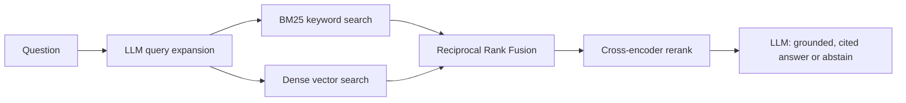

# FinDocRAG

Ask plain-English questions about SEC 10-K annual reports and get answers grounded in the filing text — with citations, or an honest "I cannot find this" when the answer isn't there.

A retrieval-augmented generation (RAG) system built from scratch over real financial filings, with a measured, honest evaluation.

## What it does

10-K filings run 100–200 pages of dense financial and legal text. FinDocRAG answers questions like *"What are AMD's main business risks?"* with a short response that cites the exact passages it used — and refuses to guess when the answer isn't in the filings.

> **Q:** What are the main business risks for AMD?
> **A:** Intel's dominance of the microprocessor market; global economic uncertainty; reliance on external financing. *[cites AMD_2022_10K::57, ::60, ::6]*

> **Q:** What is the capital of France?
> **A:** I cannot find this in the filings.

## How it works



- **Chunking:** filings split into 1,500-character overlapping passages
- **Extraction:** table-aware PDF parsing (`pdfplumber`) keeps each table row's label next to its numbers
- **Query expansion:** an LLM rewrites the question into the filing's own line-item wording before searching (e.g. "capital expenditure" → "purchases of property, plant and equipment")
- **Keyword index:** BM25 (`rank-bm25`)
- **Vector index:** `BAAI/bge-small-en-v1.5` embeddings in ChromaDB
- **Fusion:** Reciprocal Rank Fusion merges both rankings
- **Reranking:** `BAAI/bge-reranker-base` cross-encoder re-scores candidates
- **Generation:** Groq `openai/gpt-oss-20b` with a strict cite-or-abstain prompt
- **Interfaces:** FastAPI endpoint (`POST /ask`) and a Gradio web demo

## Results

Evaluated on 57 expert-written questions from [FinanceBench](https://github.com/patronus-ai/financebench) across a 15-filing slice. Metric: retrieval Recall@10 by gold-evidence overlap. Full methodology and the complete ablation are in [eval/RESULTS.md](eval/RESULTS.md).

**Retrieval ablation** — why each architecture choice earns its place:

| Configuration     | Recall@10 |
|-------------------|-----------|
| BM25 (keyword)    | 19.3%     |
| Dense (meaning)   | 33.3%     |
| Hybrid (RRF)      | 29.8%     |
| Hybrid + reranker | 33.3%     |

**Then two targeted improvements** attacked the system's hardest case — numerical questions that read financial-statement tables. Table-aware extraction made the values *retrievable*; query expansion made them *findable* across the question/filing vocabulary gap. Together they lifted the best configuration to **38.6%** Recall@10 and made previously-failing numerical questions (e.g. capital expenditure) answerable.

The standout piece of work is the **three-layer debugging investigation** behind that gain — tracing one stubborn failure through ranking, then PDF extraction, then a question/filing vocabulary mismatch. The full write-up is in [eval/RESULTS.md](eval/RESULTS.md).

**Honest note:** 38.6% is a real improvement, not a perfect score — some multi-table reasoning questions remain hard. The gap is measured and understood, not hidden.

## Quickstart

Requires Python 3.10+ and a free [Groq API key](https://console.groq.com).

```bash
# 1. Environment
python3 -m venv .venv && source .venv/bin/activate
pip install -r requirements.txt
pip install -e .

# 2. Add your Groq key
cp .env.example .env
# edit .env and set GROQ_API_KEY=gsk_...

# 3. Build data + indexes (downloads 15 filings; a few minutes)
python3 get_pdfs.py
python3 extract_text_v2.py      # table-aware extraction (pdfplumber)
python3 make_chunks.py
python3 build_vector_index.py
python3 build_bm25_index.py

# 4. Run the demo
python3 demo.py     # Gradio UI at http://127.0.0.1:7860
```

Or run the API:

```bash
uvicorn findoc_rag.api.app:app
# POST http://127.0.0.1:8000/ask  body: {"question": "..."}
```

## Tech stack

Python · sentence-transformers · ChromaDB · rank-bm25 · pdfplumber · Groq · FastAPI · Gradio · pytest · ruff · GitHub Actions

## Status & future work

A complete, working, evaluated, demoable system. Possible next steps: answer-quality metrics (faithfulness, correctness); a permanently hosted demo (e.g. Hugging Face Spaces); extending the evaluation slice beyond 15 filings.
